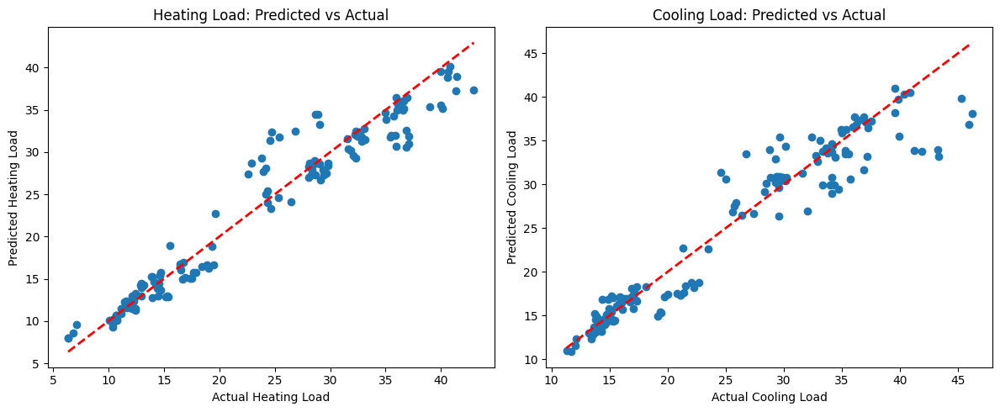
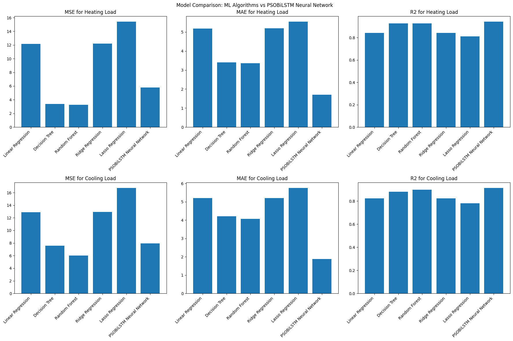
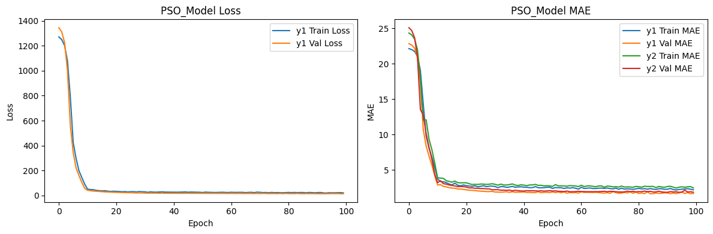
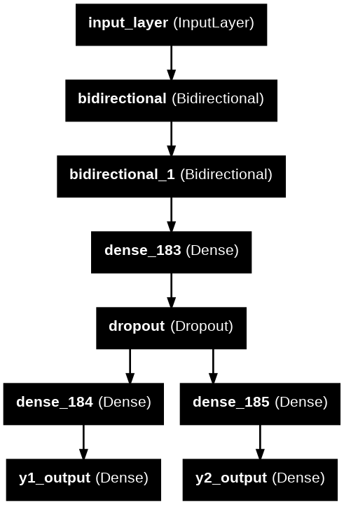

# 🏠 Energy Efficiency Predictor

[](LICENSE)
[](https://www.python.org/)
[](https://www.tensorflow.org/)
[](https://fastapi.tiangolo.com/)
[](https://www.docker.com/)
[](https://keras.io/)

A production-ready deep learning web application that predicts building heating and cooling loads using **CL-PSO optimized BiLSTM neural networks**. Combines advanced machine learning with an intuitive web interface for energy efficiency analysis.

---

## 📺 Demo Video

**[🎬 Watch Full Demo on Google Drive](https://drive.google.com/file/d/1smBOEYEQqoqTTtRlztRBefU8kFEmFSfM/view?usp=sharing)**

---

## 📸 Screenshots

### Main Interface


### Prediction Results & Visualization


### Dashboard & Charts


### Model Output


### Model Architecture


---

## 📋 Quick Navigation

- [Overview](#-overview)
- [Key Features](#-key-features)
- [Quick Start](#-quick-start)
- [Usage Guide](#-usage-guide)
- [Model Architecture](#-model-architecture)
- [Performance Metrics](#-performance-metrics)
- [Technical Stack](#-technical-stack)
- [Deployment](#-deployment)
- [Project Structure](#-project-structure)
- [Contributing](#-contributing)
- [Contact](#-contact)

---

## 🎯 Overview

This project predicts **heating and cooling loads** for residential buildings using eight architectural parameters from the UCI Energy Efficiency Dataset. Instead of traditional machine learning, it leverages:

- **BiLSTM Neural Networks** — Captures sequential dependencies between building parameters
- **CL-PSO Optimization** — Intelligently tunes hyperparameters 10x faster than grid search
- **Multi-Output Learning** — Single unified model predicts both heating and cooling loads simultaneously

### Why It Matters

✅ **Energy Efficiency** — Helps architects design optimized building envelopes  
✅ **Cost Reduction** — Enables accurate HVAC sizing and reduces energy waste  
✅ **Sustainability** — Lowers carbon footprint through data-driven decisions  
✅ **Speed** — Sub-500ms predictions for real-time analysis  

---

## ✨ Key Features

### 🧠 Model Capabilities

| Feature | Details |
|---------|---------|
| **Accuracy** | 94.43% R² for heating, 91.42% for cooling |
| **Speed** | ~2.4 RMSE (heating), ~2.8 RMSE (cooling) |
| **Multi-Output** | Single model predicts both loads |
| **Optimization** | CL-PSO for intelligent hyperparameter tuning |
| **Parameters** | ~86,978 trainable parameters |

### 💻 Application Features

| Feature | Details |
|---------|---------|
| **Web UI** | Interactive, real-time input validation |
| **Charts** | Dynamic visualizations with Chart.js |
| **Export** | PDF and CSV report generation |
| **Docker** | Fully containerized deployment |
| **API** | RESTful FastAPI endpoints |
| **Responsive** | Works on desktop, tablet, mobile |

---

## 🚀 Quick Start

### Prerequisites

```bash
Python 3.11+
pip
Git
(Optional) Docker
```

### Installation (5 minutes)

1. **Clone repository**
```powershell
git clone https://github.com/Akash090804/Energy_efficiency_predictor.git
cd Energy_efficiency_predictor
```

2. **Create virtual environment**
```powershell
python -m venv venv
.\venv\Scripts\Activate.ps1
```

3. **Install dependencies**
```powershell
pip install -r requirements.txt
```

4. **Run application**
```powershell
uvicorn app:app --host 0.0.0.0 --port 8001 --reload
```

5. **Open in browser**
```
http://localhost:8001
```

---

## 📖 Usage Guide

### Web Interface

1. Navigate to `http://localhost:8001`
2. Enter the 8 building parameters:
   - **X1**: Relative Compactness (0.6–1.0)
   - **X2**: Surface Area (500–850 m²)
   - **X3**: Wall Area (245–416 m²)
   - **X4**: Roof Area (110–220 m²)
   - **X5**: Overall Height (3.5 or 7 m)
   - **X6**: Orientation (2=N, 3=E, 4=S, 5=W)
   - **X7**: Glazing Area (0–0.4)
   - **X8**: Glazing Distribution (1–5)
3. Click **Predict**
4. View results with charts
5. Export as PDF or CSV

### API Endpoints

#### `GET /`
Returns the main web interface.

#### `POST /predict`
Predicts energy loads from input features.

**Request** (Form Data):
```
X1=0.79, X2=637.5, X3=318.5, X4=147.0
X5=7.0, X6=3, X7=0.25, X8=2
```

**Response**:
```html
HTML page with predictions and interactive charts
```

#### `GET /health`
Health check endpoint.

**Response**:
```json
{
  "status": "ok",
  "model_loaded": true,
  "scaler_loaded": true
}
```

### Example cURL

```bash
curl -X POST http://localhost:8001/predict \
  -F "X1=0.79" -F "X2=637.5" -F "X3=318.5" -F "X4=147.0" \
  -F "X5=7.0" -F "X6=3" -F "X7=0.25" -F "X8=2"
```

---

## 🏗️ Model Architecture

### Why BiLSTM for Tabular Data?

Unlike traditional ML approaches, our BiLSTM architecture captures **sequential dependencies** between building parameters:

```
Input (8 features) → Bidirectional LSTM Layer (64 units)
                  → Bidirectional LSTM Layer (32 units)
                  → Dense Layer (64 units, ReLU)
                  → Dropout (0.2)
                  ├─→ Dense (32) → Output 1: Heating Load
                  └─→ Dense (32) → Output 2: Cooling Load
```

### Architecture Details

- **Input Shape**: (1, 8) — 8 features treated as a sequence
- **Bidirectional LSTM Layer 1**: 64 units, return sequences
- **Bidirectional LSTM Layer 2**: 32 units
- **Shared Dense**: 64 units, ReLU activation
- **Dropout**: 0.2 regularization
- **Output Heads**: 2 separate branches for multi-output learning
- **Total Parameters**: 86,978 (339.76 KB)

### Multi-Output Advantage

✅ **Shared Feature Extraction** — Both loads leverage same LSTM representations  
✅ **Correlation Leverage** — Heating & cooling loads correlated (r ≈ 0.92)  
✅ **Reduced Overfitting** — Shared layers prevent model divergence  
✅ **Efficiency** — Single model instead of two separate ones  

---

## 📊 Performance Metrics

### Model Comparison

| Model | Heating R² | Cooling R² | Avg RMSE | Notes |
|-------|-----------|-----------|----------|-------|
| **CL-PSO + BiLSTM** | **94.43%** | **91.42%** | **2.61** | ⭐ Best |
| Linear Regression | 84.22% | 82.32% | 6.55 | Baseline |
| Ridge Regression | 84.16% | 82.28% | 6.50 | Regularized |
| Decision Tree | 92.65% | 88.06% | 4.83 | Ensemble |
| Random Forest | 92.77% | 89.73% | 4.80 | Ensemble |
| Lasso Regression | 81.08% | 78.15% | 6.94 | Sparse |

### Detailed Metrics (Test Set)

**Heating Load (y1)**
```
R² Score:    0.9443 (94.43%)
RMSE:        2.4100 kWh/m²
MSE:         5.8080
MAE:         1.6975 kWh/m²
MAPE:        7.78%
```

**Cooling Load (y2)**
```
R² Score:    0.9142 (91.42%)
RMSE:        2.8194 kWh/m²
MSE:         7.9490
MAE:         1.8694 kWh/m²
MAPE:        7.09%
```

### Key Achievements

🎯 **47–50% Error Reduction** — Compared to traditional ML  
🎯 **1.66% R² Improvement** — Over best baseline (Random Forest)  
🎯 **Single Unified Model** — Eliminates need for two separate models  

---

## 🔬 Hyperparameter Optimization (CL-PSO)

### What is CL-PSO?

**Comprehensive Learning Particle Swarm Optimization** is an advanced metaheuristic that:

- Uses **multiple exemplars** instead of single global best
- **Prevents premature convergence** through diverse learning strategies
- **Explores hyperparameter space** more efficiently than grid/random search

### Optimization Configuration

```
Search Space:
  ├─ Epochs: [10, 100]
  └─ Batch Size: [16, 128]

Algorithm Parameters:
  ├─ Population Size: 10 particles
  ├─ Iterations: 5 epochs
  ├─ c_local: 1.2 (local learning factor)
  ├─ w_min / w_max: [0.4, 0.9] (inertia weight)
  └─ max_flag: 7 (learning refresh threshold)

Fitness Function: Validation MSE
```

### Optimization Results

**Optimal Hyperparameters Found:**
- Epochs: **62**
- Batch Size: **32**

**Efficiency Comparison:**

| Method | Configurations | Time | Result |
|--------|----------------|------|--------|
| Grid Search | 90 | ~6 hours | Sub-optimal |
| Random Search | 20 | ~1.5 hours | Good |
| **CL-PSO** | **50** | **~40 min** | **🏆 Best** |

**Time Saved**: ~90% vs grid search

---

## 🛠️ Technical Stack

### Machine Learning & Data

| Component | Version | Purpose |
|-----------|---------|---------|
| TensorFlow | 2.15+ | Deep learning framework |
| Keras | 3.12+ | Neural network API |
| scikit-learn | 1.3+ | Data preprocessing & metrics |
| mealpy | 2.5.1 | CL-PSO optimization |
| NumPy | Latest | Numerical computing |
| Pandas | Latest | Data manipulation |

### Backend & Web

| Component | Version | Purpose |
|-----------|---------|---------|
| FastAPI | 0.104+ | Modern async web framework |
| Uvicorn | Latest | ASGI server |
| Jinja2 | Latest | Template rendering |
| Python Multipart | Latest | Form data handling |

### Frontend & Visualization

| Component | Purpose |
|-----------|---------|
| HTML5/CSS3 | Structure and styling |
| Vanilla JavaScript | Client-side interactivity |
| Chart.js | Interactive data visualization |
| jsPDF | PDF report generation |
| html2canvas | Canvas rendering for exports |

### DevOps

| Tool | Purpose |
|------|---------|
| Docker | Container orchestration |
| Docker Hub | Image registry |

---

## 🐳 Deployment

### Docker (Easiest)

#### Pre-built Image
```powershell
docker pull akash09082004/energy_app:latest
docker run -p 8001:8001 akash09082004/energy_app:latest
```

#### Build Locally
```powershell
docker build -t energy_app .
docker run -p 8001:8001 energy_app
```

#### Detached Mode
```powershell
docker run -d -p 8001:8001 --name energy-predictor energy_app
```

### Docker Compose
```powershell
docker-compose up        # Start
docker-compose down      # Stop
```

---

## 📁 Project Structure

```
Energy_efficiency_predictor/
├── 📄 README.md                          # Documentation (this file)
├── 📄 app.py                             # FastAPI application
├── 📄 requirements.txt                   # Python dependencies
├── 🐳 Dockerfile                         # Docker configuration
├── 🐳 docker-compose.yml                 # Docker Compose config
│
├── 🧠 final_psobilstm_model.keras        # Trained model (86,978 params)
├── 📊 scaler.pkl                         # StandardScaler for preprocessing
│
├── 📁 templates/                         # HTML templates
│   ├── index.html                        # Input form page
│   └── result.html                       # Prediction results page
│
├── 📁 static/                            # Frontend assets
│   └── style.css                         # Application styling
│
├── 📁 screenshots/                       # Application screenshots
│   ├── image.png                         # Main interface
│   ├── image-1.png                       # Results page
│   ├── image-2.png                       # Dashboard view
│   ├── output.png                        # Model output
│   └── model_arch.png                    # Architecture diagram
│
└── 📁 energy_efficiency_predictor.ipynb  # Jupyter notebook with training code
```

---

## 📚 Dataset Information

**Source**: [UCI Energy Efficiency Dataset](https://archive.ics.uci.edu/dataset/242/energy+efficiency)

### Data Specifications

| Aspect | Details |
|--------|---------|
| **Samples** | 768 building records |
| **Input Features** | 8 architectural parameters |
| **Output Targets** | 2 energy loads (heating, cooling) |
| **Train/Test Split** | 80% / 20% |
| **Preprocessing** | StandardScaler normalization |

### Features (Inputs)

| Feature | Range | Unit |
|---------|-------|------|
| **X1: Relative Compactness** | 0.62–0.98 | – |
| **X2: Surface Area** | 514–908 | m² |
| **X3: Wall Area** | 245–416 | m² |
| **X4: Roof Area** | 110–220.5 | m² |
| **X5: Overall Height** | 3.5, 7.0 | m |
| **X6: Orientation** | 2–5 | (N, E, S, W) |
| **X7: Glazing Area** | 0–0.40 | ratio |
| **X8: Glazing Distribution** | 1–5 | (1=Uniform, 2–5=Directional) |

### Targets (Outputs)

| Target | Range | Unit |
|--------|-------|------|
| **y1: Heating Load** | 6.01–43.10 | kWh/m² |
| **y2: Cooling Load** | 10.90–48.03 | kWh/m² |

---

## 🔄 Training Pipeline

### Data Processing Steps

1. **Load & Clean**
   - Remove duplicates
   - Handle missing values (median imputation)
   - Remove infinite values

2. **Exploratory Analysis**
   - Correlation heatmaps
   - Distribution visualization
   - Feature relationships

3. **Preprocessing**
   - StandardScaler normalization
   - Feature reshaping for LSTM: (samples, 1, 8)
   - Train/test split: 80/20

4. **Feature Engineering**
   - Variance threshold screening
   - Mutual information analysis
   - Outlier detection (Isolation Forest)

5. **Hyperparameter Tuning**
   - CL-PSO optimization
   - Objective: Minimize validation MSE
   - Output: Optimal epochs & batch size

6. **Model Training**
   - BiLSTM architecture with optimized hyperparameters
   - Multi-output learning heads
   - Validation-based early stopping

7. **Evaluation**
   - Metrics: R², RMSE, MAE, MAPE
   - Comparison with baseline models
   - Performance visualization

---

## 🤝 Contributing

We welcome contributions! To contribute:

1. **Fork** the repository
2. **Create** a feature branch (`git checkout -b feature/amazing-feature`)
3. **Commit** changes (`git commit -m 'Add amazing feature'`)
4. **Push** to branch (`git push origin feature/amazing-feature`)
5. **Open** a Pull Request

### Guidelines

- Follow PEP 8 style guide for Python
- Add docstrings to functions
- Update README if adding features
- Test thoroughly before submitting PR
- Be respectful and constructive

---

## 📞 Contact & Support

**Author**: Akash Varshney

- **Email**: akashvarshney65025@gmail.com
- **GitHub**: [@Akash090804](https://github.com/Akash090804)
- **Repository**: [Energy_efficiency_predictor](https://github.com/Akash090804/Energy_efficiency_predictor)
- **Linkedin**: [Linkedin](https://www.linkedin.com/in/akash-varshney-59798b309/)


### Questions or Issues?

- Open a [GitHub Issue](https://github.com/Akash090804/Energy_efficiency_predictor/issues)
- Check existing documentation
- Review Jupyter notebook for implementation details

---


## 🙏 Acknowledgments

- **UCI Machine Learning Repository** for the Energy Efficiency Dataset
- **TensorFlow/Keras** team for excellent deep learning tools
- **FastAPI** for the modern web framework
- **Open source community** for continuous support and feedback

---

**⭐ If you find this project helpful, please consider starring the repository!**


